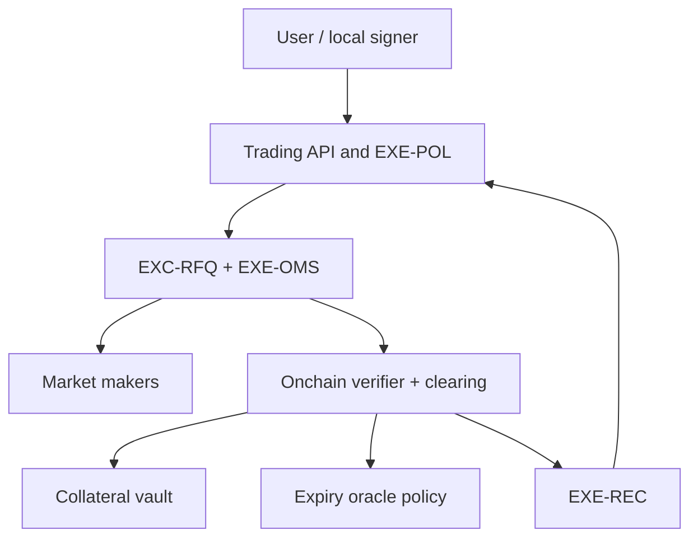

# Odelix Options Venue — design candidate

> **Основа и reuse текущей редакции:** [локальная карта внешних компонентов и адаптеров](DEVELOPMENT.md#implementation-basis). Там указаны источник, режим использования, наши модули/пути, задачи и ограничения. Кандидат не установленная зависимость; этот предметный документ не требует реализации библиотечной механики с нуля.

**Согласование r13 · 28 сентября 2026.** Основная спецификация сохранена. Для внешнего кода действует [единый реестр](DEVELOPMENT.md#DEP-52ea262d35); проектные статусы не подтверждают реализацию. Бизнес-правила/данные/риск не передаются внешним AI-frameworks. Универсальный Research не содержит обязательной пользовательской формулы.

**Редакция:** 1.0.0 · **Дата:** 2026-09-28 · **Статус:** PROPOSED / implementation status requires evidence.

## 10. Исполнение и собственная опционная площадка

### 10.1 Раздельные маршруты

| Маршрут | Где позиция и средства | Кто исполняет | Условия |
|---|---|---|---|
| Research | Позиции нет | Расчётный engine | Data/compute rights |
| PAPER | Изолированное simulated состояние | Paper adapter | Реализм и safety contract; никаких live keys |
| Partner-hosted confirmation | Личный аккаунт на venue | Площадка/разрешённый партнёр | Поддержанный handoff и точное подтверждение |
| Direct-account API/OAuth | Личный аккаунт пользователя | Внешняя venue | Approved integration, eligibility, trade-only access, reconcile |
| Native RFQ | Protocol subaccount/onchain collateral | Clearinghouse после подписанного пакета | Отдельные security/liquidity/legal gates |

Corporate omnibus и скрытая back-to-back продажа пользовательского обязательства не входят в стартовую модель. Внешний broker approval не превращается в государственную лицензию. Cross-venue legs не объявляются атомарными; одинаковые strikes/expiry labels не означают одинаковые договоры.

### 10.2 Сравнение и маршрутизация

Роутер сначала исключает недопустимые routes, затем сравнивает совместимые инструменты по наблюдаемому all-in cash cost, объёму, freshness, fee caps, slippage assumptions и предпочтениям клиента. Custody/counterparty/operational risks показываются отдельными атрибутами: выдуманного денежного «штрафа контрагента» нет.

Native preferred разрешён только как явный preference с раскрытым price tolerance. Доход платформы/реферальный rebate не подменяет критерии пользователя. Trading approval привязан к instrument/legs/quantity/price-limit/fees/venue/environment/deadline и актуальному policy. Изменение существенных условий требует пересчёта и применимого нового подтверждения.

### 10.3 OMS и recovery

Order lifecycle различает accepted, open, partially-filled, filled, cancelled, expired, rejected и outcome-unknown. Для onchain отдельно хранятся submitted, included-unfinalized, finalized, reorged/reverted. HTTP success и tx hash не означают финальное исполнение.

Повторный запрос использует clientOrderId/idempotency key. При timeout сначала запрашиваются venue order/fills или chain nonce/receipt; blind retry запрещён. Trade events, reports и projections сверяются. Unexplained mismatch запрещает увеличение риска. Отмена действует по фактическому порядку площадки/цепи: fill может победить cancel. Kill switch не обращает прошлую сделку вспять.

### 10.4 Native v0: узкий financial core

Offchain RFQ, onchain custody/clearing, deterministic risk. Начальный testnet — Arbitrum Sepolia; production candidate — Arbitrum One после проверки chain/token/oracle/operating assumptions. Свой sequencer/bridge/appchain не строится.

Первые protocol products — same-expiry bounded vertical packages с единой валютой расчёта и полным покрытием будущих обязательств **обеих сторон**. Широкий каталог исследований и внешних инструментов не означает широкий initial native listing. Naked seller BTC call с USDC collateral нельзя считать полностью обеспеченным при любом росте цены. MM whitelist не даёт исключение из backing.

V0 package quantity — whole fill-or-kill; все legs, cash, fees и locks проходят одной атомарной consistency boundary или revert. Partial fills позже требуют cumulative-filled accounting на order hash; фраза «nonce используется однажды» тогда уточняется, а не конфликтует с частичным исполнением.

Смарт-контрактные компоненты: CollateralVault, MarketRegistry, OrderVerifier/NonceManager, Clearinghouse/StrategySettlement, OracleRouter/ExpirySettlement, AgentPolicyRegistry, EmergencyModule. Это компоненты нескольких бизнес-модулей, не восемь сервисов/репозиториев.

### 10.5 Учёт, обеспечение и окончательный расчёт

Chain Clearinghouse — authority protocol positions/collateral. Offchain mirror содержит committed chain state и отдельно pending reservations. Product Capital Ledger — отчётность пользователя. Managed indexer — ускоренная read projection, не authority для withdrawal или margin.

Cash ledger ведётся double-entry по каждой валюте; position quantities и collateral locks учитываются отдельно. Mark-to-market не становится cash. Проверяются token balance, сумма claims, fees, explicitly classified surplus и deficit. Locks не повторно списывают уже выплаченную премию.

Для payout `P(S)` в единицах settlement asset будущий liability lock равен `max(0, -min P(S))` с консервативным rounding и дополнительными ещё не оплаченными обязательствами. В v0 поддержаны только доказанно bounded templates. Пример: long call spread 100k/110k с multiplier 1 имеет capped payout 10,000; полученная short-side премия может входить в эти 10,000, но не учитывается дважды.

Fixing policy закрепляется до открытия серии: feed IDs, окно, sampling/TWAP/median, units, quorum/coverage, staleness/deviation, rounding, candidate/dispute/final и fallback. Один **final** fixing авторитетен; кандидат может быть оспорен по заранее заданному правилу. Если контракт не проверяет историческую агрегацию сам, указывается доверенный механизм публикации/проверки и его риски. Слово «onchain» не доказывает правильность offchain числа.

### 10.6 Права агентов и аварийные режимы

AgentPolicy ограничивает account, environment, allowed instruments/templates/actions, expiry, order size, aggregate spend/loss и confirmation thresholds. LLM не видит master private key. Trade-only key может всё равно потерять деньги через плохие сделки; запрет withdraw недостаточен. Ограничения переводов, arbitrary call, approve/permit, upgrade и delegatecall закрывают обходы policy.

Hard limits enforce-ятся на всех допустимых путях, включая bypass обычного frontend; policy hash без verifier ничего не обеспечивает. На внешней venue часть правил может быть лишь gateway-enforced — это явно раскрывается. Невозможный hard bound не разрешает автономию по умолчанию.

При stale oracle блокируется новый риск; безопасные cancel/revoke сохраняются. Withdrawal/close разрешаются только когда их безопасность доказана актуальным состоянием. При contract exploit или неизвестных обязательствах может понадобиться более широкая остановка; безусловная гарантия «выйти всегда и немедленно» недопустима. Reopening требует reconciliation и конкретного решения ответственного.

### 10.7 Расширение

CLOB вводится при повторяющемся потоке на концентрированных strikes/expiries; RFQ остаётся для сложных/редких пакетов. FIX — по спросу MM. Любой credit/portfolio margin требует **до средств** initial/maintenance models, liquidations, auctions, default waterfall, bad-debt accounting и экономических stress tests. LP vaults дополнительно требуют NAV, hedging, queues, dilution/default allocation и legal structure. RWA требуют calendars, corporate actions, market halts, disruption и лицензированные reference data. Appchain рассматривается только при измеримой проблеме shared-L2 economics/throughput/ordering.

## 13. Безопасность, правовой контур и проверяемые ограничения

### 13.1 Разные продукты — разные полномочия

Research, personalized explanation, order transmission, discretionary execution, own venue и custody не объединяются юридически словом «AI». Перед запуском каждого режима определяется, кто пользователь, где он находится, какие инструменты доступны, кто является контрагентом/оператором, где хранятся деньги и кто принимает инвестиционное решение. Self-custody и внешний broker не отменяют автоматически обязанности Odelix. Для ЕС опционные инструменты требуют отдельного анализа в контуре финансового регулирования; нельзя подменять его общей ссылкой на crypto/MiCA. [MiFID II: перечень услуг и инструментов](https://www.esma.europa.eu/publications-and-data/interactive-single-rulebook/mifid-ii/annex-i).

Продуктовая матрица eligibility: `jurisdiction × client_category × instrument × venue × action × delegation_mode`. Неизвестная комбинация не получает execution permission. Country/IP checks — лишь сигналы, не вся процедура eligibility. Подписка на данные, пользовательский AI-agent и право торговать — независимые entitlements. Права на отображение, производные показатели, сохранение и распространение market data проверяются отдельно. Historical download от поставщика не означает права продавать исходные ticks.

Проверка проводится с профильными специалистами по фактической модели бизнеса. Документ задаёт инженерные точки контроля; он не утверждает получение лицензии, конкретную юридическую квалификацию всех режимов или доступность worldwide launch. Для ограниченной alpha также нужны разрешённые участники, terms, disclosures и incident owner.

### 13.2 Инварианты и как они проверяются

| Инвариант | Проверка и реакция |
|---|---|
| Рыночный факт и расчёт привязаны к времени/версии | PIT fixtures, schema validation, replay manifest; неизвестный источник/age не выдаётся за текущий факт |
| Нельзя использовать будущее в сигнале или отборе эксперимента | Availability-time joins, train/test boundaries, embargo, locked holdout; trial audit |
| Агент не меняет торговые полномочия текстовым запросом | Policy enforcement вне LLM, scoped tokens, independent signer, denied-path tests |
| Подпись ограничивает quantity/price/expiry/account/domain | EIP-712 или venue signing conformance, cumulative partial-fill counters, chainId/verifyingContract binding |
| Nonce/quote нельзя исполнить повторно сверх разрешённого | Replay tests, idempotent accept, cancel/fill race, finality-aware reconciliation |
| Multi-leg atomicity не заявляется без гарантии route | Capability contract и failure injection; на nonatomic route раскрывается и ограничивается legging risk |
| Liability обеспечено выбранной risk model | Conservation, double-entry cash ledger, independent position accounting, adversarial scenario tests |
| Pause не превращает любую операцию в безусловно разрешённую | Матрица действий: new risk, cancel, revoke, settle, reduce, withdraw; при угрозе vault отдельный withdraw pause допустим |
| Потеря oracle/RPC/indexer не создаёт новое достоверное состояние | Stale/circuit-breaker scenarios; candidate settlement не становится final автоматически |
| Нельзя получить подтверждённый результат через обход процедуры | Server-issued attestation с run/evidence/version ids; raw tools и external orchestration имеют другой статус |
| Другой tenant не видит данные, секреты и приватные процедуры | Storage/tool/memory isolation, authorization tests, prompt-injection tests, controlled retrieval |
| Retry не удваивает финансовое действие или платёж | Operation ids, append-only events, reservation/settlement, recovery tests |

Agent-generated research code выполняется с ограниченным CPU/time/memory, ограниченными datasets и изолированной сетью. Такой sandbox нужен уже для custom strategies; он не откладывается до multi-host scaling. Retrieval documents и marketplace packages считаются недоверенными данными, а не новыми системными инструкциями. Право «запустить backtest» не включает право читать произвольные файлы или подписать транзакцию.

### 13.3 Практический маршрут regulated partnership

Первый шаг — выбрать **один доказуемый revenue corridor**: страны, client classes, options products, выбранную venue, действия пользователя и автономию агента. Затем подготовить Partnership Pack: двухстраничное описание flow; diagram денег/заявок/ключей; country×client×product matrix; responsibility matrix; no-withdrawal signing/kill switch design; sample records; volume/cost assumptions; KYB и legal perimeter memo. Письмо площадке запрашивает отдельно API/OAuth broker status, options permissions, market-data display/derived/AI inference rights, attribution/revenue share и termination/close-only/client portability.

Кандидатов ищем через institutional/broker teams выбранных venues, официальные registers инвестиционных фирм по целевому corridor и специалистов по options execution. Названия Black Manta, Huddlestock, Concedus и Capricorn из PDF сохраняются только как **непроверенные leads**, не как выбранные, лицензированные именно для нашего flow партнёры. В этой редакции их eligibility не подтверждалась. При RFP прежде проверяется exact legal entity и permission в официальном register, затем допустимость crypto options, retail/pro, direct-account venue, AI advice и rule-based/discretionary delegation. Публичный marketing сайт не доказывает эти права.

| Функция | Odelix / TechCo | Regulated principal, если выбран | Внешняя venue |
|---|---|---|---|
| UX/StrategySpec/расчёты | Реализация, точность, provenance, recordkeeping | Утверждение регулируемого flow и oversight по договору | Quote/instrument/risk semantics своего рынка |
| Eligibility/KYC/client class | Реализует policy и безопасный handoff | Ответственность в пределах конкретной модели | Проверяет свой аккаунт/продукты/ограничения |
| Order acceptance | Техническая передача в рамках полномочий | Юридическая ответственность, если это его регулируемая услуга | Принимает собственный order |
| Execution policy | Объяснимый routing record и implementation | Согласует и контролирует применимые обязанности | Реальный fill и venue execution records |
| Custody | Не принимает custody в external direct-account модели | Только если это отдельно предусмотрено | Пользовательский venue account; native protocol — другая модель |
| Complaints/records/termination | Audit и technical support/export | Названный ответственный и договорная процедура | Позиции, close-only и withdrawals по правилам venue |

Собственная venue требует отдельной матрицы: нельзя перенести ответственность из соглашения внешнего broker на собственный Clearinghouse. Номер чужой лицензии не разрешает Odelix самостоятельно выполнять неохваченные действия. Стоимость собственного лицензирования и выбор страны определяются после product/country fit; суммы капитала из PDF не переносятся как универсальные актуальные нормы. До запуска остаются явные owners для incident, complaints, record retention и прекращения партнёрства.

## Подробные требования реализации

## 1. Решение и границы

Odelix сохраняет Market Evidence, hosted Pi Intelligence, Product Control Plane,
Connect и Workstation. Собственная venue — дополнительная капитал-критичная
система, а не новый default backend для всех пользователей.

Выбранный design candidate: offchain RFQ и предварительные проверки + onchain
custody accounting, проверка каждой сделки, collateral locking и clearing на
существующем EVM L2. Arbitrum — кандидат для сравнительного spike, не утверждённый
production dependency. Own chain, cross-chain collateral, perpetual hedge credit,
CLOB, transferable option tokens, RWA и LP vaults не входят в V1/V2.

Не называем это полностью децентрализованной биржей: RFQ routing, quote access,
frontend, relayer, oracle administration, pausing и upgrades могут быть
централизованными. Trust matrix публикуется до любого обращения реальных средств.
«Не может забрать деньги» должно следовать из deployed bytecode, полномочий
upgrader/admin и exit path, а не из слова non-custodial.

## 2. Один минимальный рынок

V1/V2: один underlying BTC, один allowlisted settlement/collateral token USDC
на одной сети, один weekly expiry cohort, 5–7 strikes как гипотеза для MM review.
Выплата linear, European, cash-settled; никаких inverse/quanto conversions.
Точный token address, decimals, multiplier, expiry, fees и oracle policy
фиксируются в deployment manifest после проверки, а не предполагаются по ticker.

Начальный торгуемый primitive — двухногий vertical call/put spread с одинаковыми
underlying, multiplier, expiry и fixing rule; количества ног 1:1. Одна сторона
держит пакет, другая — его точный отрицательный payoff. Только whole-package
fill-or-kill; partial fills, leg stripping, independent leg transfer и rolling
между экспирациями отключены. Закрытие — противоположный целый пакет с проверкой
post-state. Atomic open не доказывает atomic close: оба пути тестируются.

Почему не «все retail long options»: у покупателя call риск ограничен премией,
но у продавца naked linear call payout не ограничен. Поэтому whitelist MM не
даёт исключений из полного обеспечения. Cash-secured puts, covered calls,
отдельные long options и 4-leg packages — следующие instrument-profile releases,
только после доказательства collateral semantics для обеих сторон. Wrapped BTC
не объявляется автоматически покрытием USDC-settled call.

## 3. Ownership и источники истины

| Объект | Authoritative owner | Что НЕ является источником истины |
|---|---|---|
| Venue observation, IV surface, analytical valuation | `MKT-IR/MKT-OPT` | LLM, browser, copied DTO |
| Listed protocol series and immutable payoff/fixing specification | `EXC-REG` onchain state | Display instrument symbol |
| Account collateral, net obligations, position/package locks | `EXC-CLR` onchain Clearinghouse | PostgreSQL, Redis, indexer, Product Capital Ledger |
| Signed order, local lifecycle/reservation | `EXE-OMS` offchain log | HTTP success interpreted as fill |
| Signed quote and RFQ routing lifecycle | `EXC-RFQ` | Indicative price |
| Order/account economic permission | `EXE-POL` plus onchain verifier | OAuth scope, Pi role, vendor wallet policy alone |
| Observation of chain state/finality | `EXE-REC` reconciliation | Indexer timestamp alone |
| User portfolio reporting and attribution | `CAP-LED/CAP-PORT` in Product | Authority to mint protocol collateral |

Offchain ledger mirrors committed chain state plus separately labelled pending
reservations. Chain defeats a conflicting cache; discrepancy blocks new risk
and withdrawals dependent on uncertain state. Operational intents remain in the
offchain log: chain alone cannot explain every rejected RFQ or timeout.

Indexing can be managed, but reconciliation independently obtains block-hash-bound
receipts/logs/state and detects provider disagreement, missing logs and reorgs.
No cross-repo database access. Market journal remains `HFTJRN02`; do not migrate
its history to Timescale merely to fit a new architecture diagram.

## 4. Runtime composition

One Rust composition host initially owns OMS/RFQ/preflight/reconciliation modules;
modules communicate by typed in-process calls. Separate signer trust process;
Solidity contracts are a separate runtime/audit surface inside the future
`odelix-execution` repo. Solidity and Rust do not share mutable storage.
Contracts/core changes have paired conformance releases; a separate contracts repo
requires actual release/security need, not one repo per smart contract.

API: REST commands/queries + WebSocket event stream and maker transport. MCP is
an adapter over the same authorized SDK commands; it is not the tick path.
Retain existing OpenAPI/JSON contracts. Protobuf is a candidate for new measured
binary/RPC boundaries, not a mandate to rewrite the market journal or all modules.
No simultaneous mandatory REST+gRPC+ConnectRPC+WebRPC+FIX stack for MVP.
FIX and CLOB are activated only by demonstrated counterparties/volume.

## 5. Instrument identity

`InstrumentSpecRef` includes semantic version/content digest and source namespace.
Human symbol is a label, never the complete identity. Model fields include:
underlying ID, call/put, integer strike+scale, quantity lot+multiplier, payout
formula ID, exercise style, expiry epoch seconds UTC, settlement asset+chain,
oracle/fixing policy hash, trade cutoff, fee/risk category, status and revision.

`MKT-IR` owns observations and effective-dated mappings. `EXC-REG` owns admissible
protocol markets and their immutable payoff/fixing spec; it consumes a reviewed
mapping rather than replacing the market catalogue. Freeze spec before listings;
new economic meaning requires a new series. Chain address/network environment
belongs in executable references and signatures.

Deribit and other venues have different contract, quotation and delivery units.
Normalize through `VenueAdapter`; do not turn inverse premium into USDC by merely
changing a currency label. Deribit's March 2026 delivery-change announcement is
a concrete reason to version settlement adapters by effective date, not assume
all past/future expiries behave identically. [Deribit delivery update](https://insights.deribit.com/exchange-updates/change-to-option-delivery-process/).

## 6. Signing and acceptance contract

EIP-712 defines typed signing, not the exchange's replay/cancellation policy.
EOA signatures and contract-wallet signatures need distinct validated paths;
ERC-1271 validity may depend on current wallet state. Check at execution, not
only at RFQ intake. [EIP-712](https://eips.ethereum.org/EIPS/eip-712),
[ERC-1271](https://eips.ethereum.org/EIPS/eip-1271).

Proposed signed package includes account/subaccount, chainId, verifyingContract,
protocol version, environment, canonical ordered legs/spec hashes, lot quantity,
maker/taker binding, quoteId, fee cap, all-in cash limit, deadline UTC seconds,
nonce, policy ID/hash/version and session epoch. Domain separator and payload
jointly prevent cross-chain, cross-instance, cross-version and cross-account use.
SDK pins the EIP-712 type definition; Protobuf/JSON serialization is not the
signing preimage. ABI/EIP-712 encoders get shared hash vectors.

Use `cashDirection: PAY|RECEIVE` + nonnegative integer token amount for user
limits: maximum net debit inclusive of fees, or minimum net credit after fees.
Signed maxDebit/minCredit cannot be simultaneously ambiguous. Gas budget is
separate and visible; user-paid native gas is not silently included in USDC cap.
Canonicalization happens before the user sees/signs the package; never reorder
or alter legs after signing.

V1 order nonce is single-use and consumes the entire authorized package once.
If later partial fills are enabled, replace blanket "nonce once" with signed
orderHash/cumulativeFilled semantics: total fill cannot exceed authorized lots;
cancel invalidates remaining lots. Partial fill requires new conformance release.

RFQ quote is firm only if signed, correctly scoped, unexpired and executable;
offchain eligibility does not guarantee collateral at future inclusion. V1 keeps
one outstanding accept per subaccount and reserves locally before submit; chain
serializes and independently rechecks both counterparties. Conflicting onchain
transaction may still cause a safe revert; the UI does not promise a fill.

## 7. Order lifecycle and chain finality

Do not flatten trading status and settlement status into one boolean `filled`.

| Trading lifecycle | Settlement observation |
|---|---|
| CREATED → VALIDATED → RFQ_OPEN → QUOTED → ACCEPT_REQUESTED | NOT_SUBMITTED |
| MATCHED_PENDING_CHAIN | SUBMITTED / OUTCOME_UNKNOWN |
| FILLED (chain acceptance observed) | INCLUDED_UNFINALIZED |
| FILLED | FINALIZED under named ChainFinalityPolicy |
| REJECTED / EXPIRED / CANCELLED | REVERTED / NOT_SUBMITTED as applicable |
| RECONCILING | REORGED / PROVIDER_DISAGREEMENT |

Store chainId, txHash, blockNumber, blockHash, txIndex, logIndex and policy ref.
`FINALIZED` is a named L2/L1 criterion; sequencer receipt is not equivalent to
L1-finalized data. Bridge withdrawal completion is separate. Never hardcode one
confirmation or a universal finality time. [Arbitrum finality](https://docs.arbitrum.io/how-arbitrum-works/deep-dives/finality).

Timeout: mark OUTCOME_UNKNOWN, query tx/order/nonce and reconcile before resubmit.
Replacement transaction retains semantic order ID and compatible nonce semantics.
On reorg restore last common ancestor projection, append reorg observation,
invalidate dependent UI/billing projections and replay canonical logs. Do not
erase historical facts or turn an orphaned receipt into settled collateral.

Offchain cancel is only an acknowledgement that routing stops locally.
`CANCEL_REQUESTED` is not `CANCEL_EFFECTIVE`: an earlier included fill can win.
Onchain cancellation/session revocation becomes effective in chain order; report
the exact block and affected remaining orders. Kill switch stops new local sends
immediately, but cannot undo a finalized trade or guarantee instant onchain revoke.

## 8. Collateral v0 and accounting

For a linear same-expiry package, let `P(S)` be future signed payout in the
settlement token at `S >= 0`, excluding premium already exchanged and fees.
Required future liability lock is `max(0, -min P(S))` with conservative integer
rounding and separately reserved unpaid fees. Reject unbounded negative tails.
V0 evaluates only admitted vertical templates; no arbitrary strategy DSL in EVM.

Illustration, not a quote: 1 BTC multiplier, call spread strikes 100,000/110,000,
premium 300 USDC, buyer fee 2, seller fee 2. Long package future payoff is
`clamp(S-100000, 0, 10000)`. Buyer pays 302 now and owes no future payout; seller
receives net 298 and must retain 10,000 collateral for future liability, requiring
9,702 additional funds if no other balance exists. Fees total 4. Do not lock
9,702 *after* also crediting 298 and call that 10,000 of backing.

Package locks isolate series/strategy obligations. V0 does not reuse a hedging
leg across several spreads or grant scenario margin to MM. Close/restructure
atomically recomputes remaining liability; removing the protective leg alone is
rejected. All liabilities, not just the retail side, are covered.

Cash ledger uses integer smallest-token units, explicit units/scales, checked
overflow and specified rounding. Analytical IV/Greeks can use controlled
floating-point with documented tolerances; they never silently round into ledger
authority. Payout uses exact deterministic arithmetic agreed between Rust/EVM.

Separate books:

- cash double-entry journals (debits equal credits for each token and transaction);
- signed position quantities (buyer/seller opposite lots per series);
- collateral locks (reclassification, not a second expense);
- analytical unrealized PnL (projection, not spendable collateral);
- protocol fees/insurance (separate claims, never counted twice as user assets).

Example cash entries: debit buyer liability 302; credit seller liability 298;
credit fee equity/payable 4. Option lots are a separate position journal, not
the balancing entry for cash. Chain token balance must equal accounted claim
buckets plus explicitly classified surplus; unsolicited transfers are unallocated
surplus, not user deposits. Any deficit is an incident. Token rebasing,
fee-on-transfer and unsupported decimals are rejected for v0.

`EXC-CLR` owns the atomic clearing transaction across counterparties, fees,
position updates and locks. This is one explicit multi-account financial
consistency boundary, not a saga between independent buyer/seller ledgers.
The general Product "one aggregate command" rule does not authorize splitting
this settlement into partially committed cross-module operations. Onchain
verification and all legs/cash/locks commit or revert in the same transaction.

## 9. Smart-contract responsibilities

| Component | Business owner | Required safety boundary |
|---|---|---|
| CollateralVault | EXC-CLR | Deposit receipts, constrained withdrawal; no generic admin sweep of obligations |
| MarketRegistry | EXC-REG | Immutable series spec; allowlist and new-risk status |
| OrderVerifier / NonceManager | EXE-POL / EXE-OMS | Signer, policy epoch, limits, replay, counterparties |
| Clearinghouse + StrategySettlement | EXC-CLR | Single atomic cash/positions/collateral transition |
| OracleRouter + ExpirySettlement | EXC-FIX | Precommitted data/fallback/fixing/finality procedure |
| AgentPolicyRegistry | EXE-POL | Least authority, onchain hard bounds, session revocation |
| EmergencyModule | EXE-KS | Action-specific pause, risk-off and constrained recovery |

These are code/audit components; they do not automatically become seven business
modules, seven repositories or seven microservices. Avoid both a giant privileged
contract and a network of modules with arbitrary `delegatecall` authority.
Use reviewed cryptographic/token/access primitives. Proposed default is a
non-upgradeable versioned v0 deployment with explicit unwind/migration; if proxies
are chosen, timelock, role separation, delay/exit window and upgrade threat tests
become required. Pauser cannot rewrite settlement or confiscate collateral.

## 10. Oracle, mark and expiry are different authorities

Observed venue mark, Odelix analytical value, MM executable quote, protocol
collateral rule and final expiry fixing are separate types. A theoretical mark
does not become an executable quote or a settlement price by changing its label.
V0 collateral does not rely on IV marks; full-liability backing limits model risk.

Fixing specification is frozen before opening positions: feed IDs, units,
window [start,end), TWAP/sampling method, minimum coverage, staleness/confidence
limits, outlier treatment, rounding, submission delay and finalization rule.
If the contract cannot recompute/verify historical TWAP, name the trusted oracle
committee/proof mechanism and challenge window. Do not write "onchain verified"
for an unverified operator-provided number.

Expiry states: OPEN → EXPIRED_AWAITING_DATA → FIXING_PROPOSED → DISPUTED or
FIXING_FINAL → SETTLED. Exactly one *final* fixing is authoritative. Candidate
correction before finalization is allowed under the frozen dispute rule; no
discretionary historical edits afterwards. Missing-data path delays settlement
or uses a precommitted fallback; a forced refund is not automatically fair or
solvent. Close pricing on stale data is not assumed safe.

Stale/conflicting feeds, network liveness loss and sequencer outage stop new
risk. Reopening after outage needs freshness and an explicit grace policy.
Pyth and Chainlink are candidate adapters, not assumed available/independent for
all required series on the chosen chain. [Pyth guidance](https://docs.pyth.network/price-feeds/core/best-practices),
[Chainlink sequencer feeds](https://docs.chain.link/data-feeds/l2-sequencer-feeds).

## 11. Delegated agents

No master key in LLM, prompts, traces, browser-readable storage or API logs.
Local signer/secure wallet adapter consumes exact typed orders and reviewed
policy; it is a non-LLM security component, not a second trading harness.
External agents need not run Pi to use deterministic tools.

Onchain hard policy: account/subaccount, signer, target contract/selector,
chain/environment, expiry/session epoch, market/template allowlist, size and
all-in price/fee caps, collateral bounds; no withdrawals, arbitrary call,
approve/permit, transfer, upgrade, delegatecall or nested call escape.
A malicious agent can lose money through adverse trades without withdrawing:
enforce economic spend/loss limits, not just action names.

Per-day/cumulative spend must be counted across all entry paths if called a hard
limit. Otherwise label it advisory/gateway-only. `policyHash` alone proves no
execution of the policy. Greek/scenario bounds require a validated current model
and chain-consistent counters or a disclosed trusted verifier; v0 uses simpler
fully enforceable lot/cash/package limits. Unsupported constraints → reject
autonomous authorization, not silently omit them.

Subscription/OAuth authorizes product access; it grants no trading power.
COPILOT: signed approval of exact executable terms, expiry and environment.
AUTONOMOUS: separately approved mandate and live rollout gate; not default V2.
LLM confidence or `ODELIX_PROCEDURE_VERIFIED` never acts as execution approval.
No withdraw tool in MCP/WebMCP; user withdrawal remains possible via reviewed
wallet/contract interface without Odelix frontend, subject to chain and solvency.

## 12. Emergency and failure matrix

| Failure | Stop | Preserve when provably safe | Recovery condition |
|---|---|---|---|
| LLM down/injected | Managed explanation/new proposals | Cancel, revoke, deterministic account reads | Normal capability/trace checks |
| Oracle stale or conflicting | New risk, oracle-dependent close/withdraw | Cancel/revoke; non-price-dependent free collateral withdrawal | Frozen freshness/fixing policy satisfied |
| Sequencer/RPC unavailable | New submissions; finality claims | Queue status; documented L1/alternate access if actually available | Canonical reconciliation + grace |
| Ledger/indexer mismatch | New risk and uncertain withdrawals | Chain reads, independent investigation, revocation | Zero unexplained mismatch |
| Signer compromised | Session, routes and pending unsigned work | Onchain revoke/cancel request | New session after effective revocation |
| Contract exploit suspected | Affected operations including withdrawals if needed to prevent loss | Safe actions only under tested pause matrix | Independent incident decision |
| MM disappears | New RFQs to maker | Fully backed expiry settlement; alternate whole-package quote | Liquidity/service recovery |
| Stablecoin depeg/freeze | New collateral/risk | Controlled accounting; precommitted resolution | Explicit recovery decision, not magical USD guarantee |

Do not promise unconditional safe close, instant withdrawal or instant kill under
all failures. Exit requires chain inclusion, available settlement data, solvent
claims and the deployed authorization path. Publish runbooks and test them.

## 13. Advanced risk and defaults — hard prerequisite, not later cleanup

If any party receives undercollateralized exposure, scenario margin, hedge credit
or leverage, V3 requires *before real funds*: initial/maintenance model, liquidator
path and incentives, stressed auction simulations, bad-debt accounting, funded
default waterfall, concentration caps and insolvency/runbook/legal approval.
Insurance is not an unlimited loss guarantee. V2 full backing avoids credit-style
margin liquidations but not contract, oracle, token, chain or custody losses.

Portfolio margin is not itself a reason to need an appchain; gas/state/latency
measurements must demonstrate the limitation of existing deployment. CLOB does
not cure liquidity and does not automatically activate advanced margin.

## 14. Release evidence

V1: end-to-end testnet deposit→RFQ→accept→clearing→expiry→withdraw with valid and
hostile paths; reorg/duplicate/revert replay; Rust/EVM math and signature vectors;
two independent simulated maker clients; no real keys/funds.

V2: named legal/security/risk/operations owners; exact deploy hash and config;
independent audits/remediation/retest for contracts AND signer/Rust/relay paths;
critical invariant evidence; funded operational and audit budget; independent
keyholders where promised; exercised incident/recovery drills; demonstrated MM
commitments and executable quote quality; caps/fee/fixing/token/finality policy
approved; initial human-confirmed small cohort. No placeholder passes a gate.

Mainnet is not scheduled by elapsed weeks or a single "security review" checkbox.
Public mainnet, autonomous trading and advanced risk are separate promotions.
